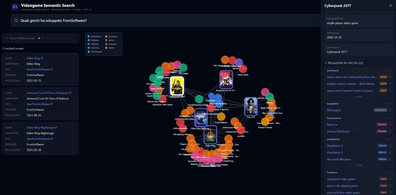

# Videogame Semantic Search

**[🎮 Demo live](https://videogame-semantic-search.vercel.app)**



Un progetto di Semantic Web che costruisce e interroga un'ontologia OWL sui videogiochi (dal 2010 ad oggi) tramite un'interfaccia web moderna con grafo di conoscenza interattivo.

## Ontologia — Statistiche

| Metrica                | Valore completo | Valore demo (2020–2026) |
| ---------------------- | --------------- | ----------------------- |
| Periodo coperto        | 2010 – 2026     | 2020 – 2026             |
| Triple totali (grezzo) | ~1.019.589      | —                       |
| Triple dopo reasoning  | ~1.427.081      | —                       |
| Triple dopo pruning    | ~1.173.959      | **~745.400**            |
| Giochi                 | ~104.000        | ~68.700                 |
| Entità deduplicate     | 4.420 rimosse   | —                       |
| Fonte                  | Wikidata SPARQL | Wikidata SPARQL         |

L'ontologia viene generata in circa **5 ore** di computazione (query per anno × mese per evitare i timeout di Wikidata), poi viene applicata la chiusura deduttiva OWL-RL tramite `owlrl` per materializzare le proprietà inverse e le catene `subPropertyOf`. Infine viene eseguito un pruning che rimuove triple non utilizzate (owl:sameAs riflessivi, gameDescription, officialWebsite) per ridurre il consumo di memoria a runtime.

> **Demo live:** per rientrare nei limiti di RAM di Render (512 MB), la demo usa un sottoinsieme dell'ontologia limitato ai giochi dal **2020 in poi** (~745k triple, ~68.700 giochi). Il dataset completo (2010–2026, ~1.17M triple) è generabile localmente.

## Architettura

```text
┌─────────────────────────────────────────────────────────────────┐
│         Frontend (React + Tailwind + react-force-graph)         │
│  ┌──────────┐  ┌──────────────┐  ┌───────────────────────────┐  │
│  │ SearchBar│  │  ResultList  │  │   Knowledge Graph (2D)    │  │
│  └──────────┘  └──────────────┘  └───────────────────────────┘  │
└──────────────────────────────┬──────────────────────────────────┘
                               │ HTTP (REST API)
┌──────────────────────────────▼──────────────────────────────────┐
│                        Backend (FastAPI)                        │
│  ┌────────────────────────────────────────────────────────────┐ │
│  │                 SPARQL Agent (GPT-4.1 mini)                │ │
│  │              NL → SPARQL → Validate → Execute              │ │
│  │        (retry automatico su errore, max 3 tentativi)       │ │
│  └────────────────────────────────────────────────────────────┘ │
│  ┌─────────────────────┐  ┌───────────────────────────────────┐ │
│  │   OntologyService   │  │          GraphBuilder             │ │
│  │    (pyoxigraph)     │  │    (nodi + archi per frontend)    │ │
│  └─────────────────────┘  └───────────────────────────────────┘ │
│  ┌─────────────────────┐  ┌───────────────────────────────────┐ │
│  │  Upstash Redis      │  │     Wikipedia Image API           │ │
│  │  (cache asincrona)  │  │     (fallback cover art)          │ │
│  └─────────────────────┘  └───────────────────────────────────┘ │
└──────────────────────────────┬──────────────────────────────────┘
                               │
┌──────────────────────────────▼──────────────────────────────────┐
│  Ontologia (videogames_pruned_2020.owl)                         │
│  Store: pyoxigraph (Rust) · ~745k triple · ~250 MB RAM (demo)   │
│  Classi: VideoGame, Developer, Publisher, Genre, Platform,      │
│          Character, Franchise, Award, GameEngine                │
└─────────────────────────────────────────────────────────────────┘
```

## Requisiti

- Python 3.12+ (gestito da uv)
- [uv](https://docs.astral.sh/uv/) (package manager Python)
- Node.js 18+ / [Bun](https://bun.sh)
- Chiave API OpenAI (per GPT-4.1 mini)
- Upstash Redis (opzionale, per cache immagini)

## Setup

### 1. Clona e posizionati

```bash
cd Videogame-Semantic-Search
```

### 2. Installa dipendenze Python (con uv)

```bash
uv sync
```

### 3. Popola l'ontologia

```bash
cd ontology
uv run python populate_wikidata.py
```

> **Attenzione**: la popolazione richiede circa **5 ore** (query per anno × mese verso Wikidata + OWL-RL reasoning finale). Richiede connessione internet. Il file risultante `videogames_wikidata.owl` non è incluso nel repository per via delle dimensioni.

### 4. Pruna l'ontologia (opzionale, consigliato)

```bash
uv run python ontology/prune_owl.py
```

Genera `videogames_pruned.owl` rimuovendo ~253k triple inutili a runtime (sameAs riflessivi, descrizioni, siti web). Riduce la RAM da ~1.5 GB a ~389 MB.

### 5. Configura variabili d'ambiente

Crea un file `.env` nella root del progetto:

```env
OPENAI_API_KEY=sk-your-api-key-here
OPENAI_MODEL=gpt-4.1-mini
UPSTASH_REDIS_REST_URL=https://...   # opzionale
UPSTASH_REDIS_REST_TOKEN=...         # opzionale
```

### 6. Avvia il backend

```bash
uv run uvicorn backend.main:app --reload --host 0.0.0.0 --port 8000
```

### 7. Frontend

```bash
cd frontend
bun install
bun run dev
```

L'app sarà disponibile su [http://localhost:5173](http://localhost:5173)

## Funzionalità

### Ricerca in linguaggio naturale

Scrivi domande come:

- "Quali giochi ha sviluppato FromSoftware?"
- "Top 10 giochi con il Metacritic più alto"
- "Giochi RPG usciti nel 2023"
- "Giochi della serie Zelda disponibili su Switch"

### Grafo di conoscenza interattivo

- **Nodi colorati** per tipo (gioco, developer, genere, etc.)
- **VideoGame come rettangoli portrait** con immagine di copertina o emoji placeholder
- **Animazione physics-based** con forze e repulsione
- **Click su nodo** → pannello dettaglio con tutte le proprietà e relazioni
- **Click destro** → menu contestuale per espandere il grafo o rimuovere nodi
- **Filtro per tipo** nella legenda — click per nascondere/mostrare categorie
- **Hover** → evidenzia connessioni dirette (nodo in primo piano con z-order)
- **Zoom/pan** per esplorare il grafo
- **Recentra** button per zoom-to-fit
- **Sidebar** → click su relazione espande il nodo nel grafo

### Agente SPARQL intelligente

- Converte NL → SPARQL automaticamente
- **Validazione sintattica** prima dell'esecuzione
- **Retry automatico** (max 3 tentativi) su errore o risultati vuoti
- Mostra la query SPARQL generata (espandibile)

### Cache a due livelli

- **Upstash Redis** (cloud, persistente, TTL 7 giorni) per immagini e risultati query
- **In-memory** (Python dict) per label e tipi derivati dal grafo RDF
- Risultati null non vengono cachati (permettono retry su Wikipedia)

## Ontologia

### Classi

| Classe       | Descrizione                            |
| ------------ | -------------------------------------- |
| `VideoGame`  | Un videogioco                          |
| `Developer`  | Studio di sviluppo                     |
| `Publisher`  | Editore                                |
| `Genre`      | Genere (RPG, FPS, Action...)           |
| `Platform`   | Piattaforma (PS5, PC, Switch...)       |
| `Character`  | Personaggio nel gioco                  |
| `Franchise`  | Serie/franchise (Zelda, Dark Souls...) |
| `Award`      | Premio ricevuto                        |
| `GameEngine` | Engine usato per sviluppare il gioco   |

### Proprietà principali

| Proprietà         | Dominio   | Range       |
| ----------------- | --------- | ----------- |
| `developedBy`     | VideoGame | Developer   |
| `publishedBy`     | VideoGame | Publisher   |
| `hasGenre`        | VideoGame | Genre       |
| `availableOn`     | VideoGame | Platform    |
| `hasCharacter`    | VideoGame | Character   |
| `belongsTo`       | VideoGame | Franchise   |
| `wonAward`        | VideoGame | Award       |
| `madeWith`        | VideoGame | GameEngine  |
| `releaseDate`     | VideoGame | xsd:date    |
| `metacriticScore` | VideoGame | xsd:integer |
| `countryOfOrigin` | VideoGame | xsd:string  |

### Processo di popolamento

1. **Query per anno × mese** (2010–2026) verso Wikidata per 12 tipologie di dati (core, generi, piattaforme, personaggi, franchise, game mode, Metacritic, engine, paese, sito web, premi, descrizioni)
2. **Deduplicazione** degli URI con stesso nome (normalizzato): 4.420 entità duplicate rimosse
3. **OWL-RL reasoning** con `owlrl`: materializzazione di proprietà inverse e catene subPropertyOf → da ~1M a ~1.4M triple
4. **Pruning** (opzionale): rimozione di `owl:sameAs` (tutti riflessivi), `gameDescription`, `officialWebsite` → da ~1.4M a ~1.17M triple

### Fonti dati

- **Wikidata**: tutti i dati (via SPARQL endpoint pubblico)

## Stack Tecnologico

| Layer     | Tecnologia                               |
| --------- | ---------------------------------------- |
| Frontend  | React 18, TypeScript, Vite, Tailwind CSS |
| Grafo     | react-force-graph-2d                     |
| Backend   | FastAPI, Python 3.12+, async             |
| Ontologia | pyoxigraph (Rust), OWL 2, owlrl          |
| LLM       | OpenAI GPT-4.1 mini                      |
| Cache     | Upstash Redis (async) + in-memory        |
| Dati      | Wikidata SPARQL                          |
| Deploy    | Render (backend) + Vercel (frontend)     |

## API Endpoints

| Metodo | Endpoint            | Descrizione                    |
| ------ | ------------------- | ------------------------------ |
| POST   | `/api/query`        | Ricerca NL → risultati + grafo |
| GET    | `/api/node/{uri}`   | Dettaglio nodo + sottografo    |
| GET    | `/api/image-search` | Cerca cover art da Wikipedia   |
| GET    | `/api/stats`        | Statistiche ontologia          |
| GET    | `/api/health`       | Health check                   |

## Performance

| Metrica              | rdflib (prima) | pyoxigraph (completo) | pyoxigraph (demo 2020+) |
| -------------------- | -------------- | --------------------- | ----------------------- |
| RAM a runtime        | ~1.550 MB      | ~389 MB               | ~250 MB                 |
| Tempo di caricamento | ~41s           | ~2.2s                 | ~1.5s                   |
| Query SPARQL tipica  | 1–23s          | 0.08–0.37s            | 0.05–0.25s              |
| Speedup query        | —              | 5–62×                 | —                       |
